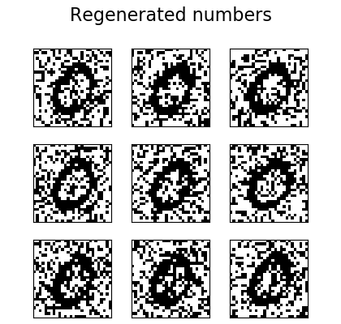
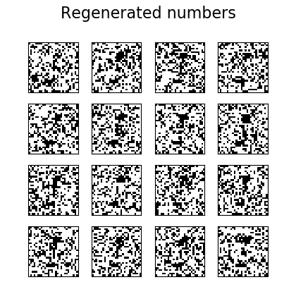

# Sparse Graph Network
This code runs a novel neural network implementation - a network that is a k-regular graph, trained via loopy belief propagation.

## Dependencies
* numpy
* matplotlib
* torch
* torchvision
* scipy

## Running Instruction

The script can be run with the following arguments

        python main.py [-l] [-t] [-p] [-x] [-s] [-d]
        [-g] [-n] [-k]
        [-e] [-b] [-lr] [-ld] [-ep] [-mi] [-th] [-da]

        -l, --load, whether to load previously trained model
        -t, --train, whether to train model
        -p, --plot, whether to plot results of model
        -x, --exact, whether to do exact inference
        -s, --save, whether to save model at end of training
        -d, --numbers, list of numbers to train on form MNIST
        -g, --graph-type, 1 for erdos-renyi, 2 for k-random
        -n, --nodes, number of nodes in graph
        -k, --degree, degree of nodes if using k-random
        -e, --epochs
        -b, --batch_size
        -lr, --learning_rate
        -ld, --lr_decay
        -ep, --epsilon
        -mi, --max_iters
        -th, --threshold
        -da, --damping
        

## Results

Graph fails to learn multimodal distributions. Here is output for training on single digit (0).

And here is when training on both 0 and 1.

